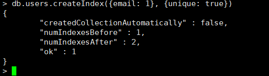

# cloud platform system 后端
## 虚拟Linux
### centos虚拟
```shell
docker pull registry.cn-shanghai.aliyuncs.com/yore/bigdata:7.8.2003_v1

docker run --privileged=true --cap-add SYS_ADMIN -e container=docker -it -p 10022:22 -p 10080:80 -d --name c1 db0f979c4417 /usr/sbin/init
```

## 数据库
### redis
> 拉取镜像并启动
```shell
docker pull redis

docker run -p 6379:6379 --name redis -v /home/redis/data:/data -d redis
```
> 设置密码
```shell
docker exec -it redis redis-cli

config set requirepass 123456
config get requirepass

auth password
```

### MongoDB
> 拉取镜像并启动
```shell
docker pull mongo:4.4

docker run -itd --name mongo -v /home/mongo/data:/data/db -p 27017:27017 mongo:4.4
```
> 设置密码与权限
```shell
 docker exec -it mongo mongo admin

db.createUser({ user:'root',pwd:'root',roles:[ { role:'userAdminAnyDatabase', db: 'admin'},'readWriteAnyDatabase']});
```

#### 设置唯一索引-email
